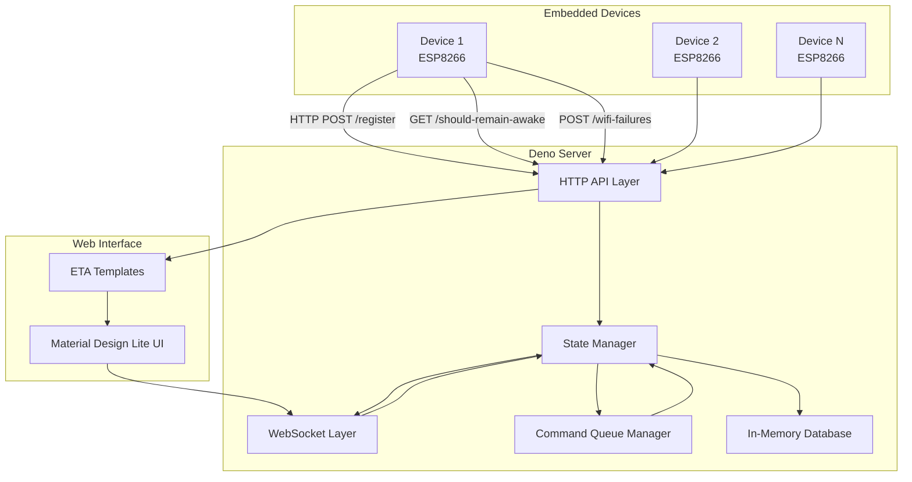
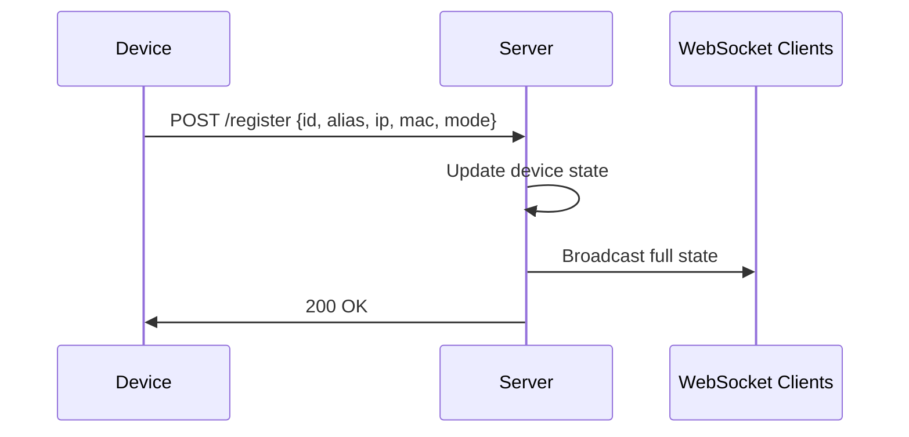
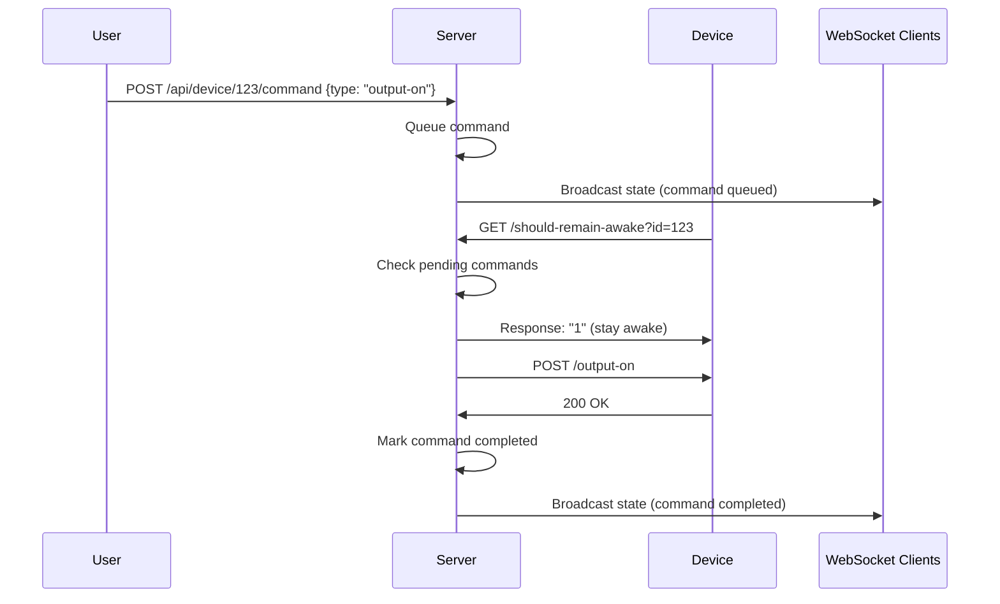

# WiFi Device Management Server - Technical Architecture Plan

## 📋 **Project Overview**

A comprehensive Deno TypeScript server for managing ESP8266 WiFi sensor devices with real-time web interface, command queuing, and device lifecycle management.

## 🏗️ **System Architecture Overview**



## 📁 **Project Structure**

```
server/
├── deno.json                 # Deno configuration
├── main.ts                   # Application entry point
├── src/
│   ├── types/
│   │   ├── device.ts         # Device type definitions
│   │   ├── command.ts        # Command queue types
│   │   └── api.ts           # API request/response types
│   ├── managers/
│   │   ├── StateManager.ts   # Single source of truth state management
│   │   ├── CommandQueue.ts   # Command scheduling and execution
│   │   └── DeviceManager.ts  # Device lifecycle management
│   ├── api/
│   │   ├── deviceRoutes.ts   # Device communication endpoints
│   │   ├── webRoutes.ts      # Web interface routes
│   │   └── apiRoutes.ts      # REST API for frontend
│   ├── websocket/
│   │   └── wsHandler.ts      # WebSocket connection management
│   ├── utils/
│   │   ├── logger.ts         # Logging utilities
│   │   └── scheduler.ts      # Task scheduling
│   └── middleware/
│       ├── cors.ts           # CORS handling
│       └── validation.ts     # Request validation
├── views/
│   ├── layouts/
│   │   └── main.eta          # Base layout template
│   ├── pages/
│   │   ├── dashboard.eta     # Device overview dashboard
│   │   ├── device.eta        # Individual device control
│   │   └── settings.eta      # System settings
│   └── partials/
│       ├── device-card.eta   # Device status card component
│       └── command-queue.eta # Command queue display
├── static/
│   ├── css/
│   │   ├── material.min.css  # Material Design Lite
│   │   └── custom.css        # Custom styles
│   ├── js/
│   │   ├── material.min.js   # MDL JavaScript
│   │   ├── websocket.js      # WebSocket client
│   │   └── app.js           # Main application logic
│   └── icons/               # Material Design icons
└── README.md
```

## 🔧 **Core Components Design**

### 1. **State Manager** (Single Source of Truth)
```typescript
interface DeviceState {
  id: string;                    // Serial number from device
  alias: string;                 // User-friendly name
  ipAddress: string;
  macAddress: string;
  firmwareVersion?: string;
  mode: number;                  // Operating mode (0-5)
  isOnline: boolean;
  lastSeen: Date;
  contactHistory: ContactRecord[];
  currentOutput: boolean;        // Current on/off state
  sensorData?: SensorReading[];
  pendingCommands: Command[];
}

interface SystemState {
  devices: Map<string, DeviceState>;
  commandQueue: Command[];
  systemStats: SystemStats;
}
```

### 2. **Command Queue System**
```typescript
interface Command {
  id: string;
  deviceId: string;
  type: 'output-on' | 'output-off' | 'set-mode' | 'rename';
  payload?: any;
  scheduledFor: Date;
  createdAt: Date;
  attempts: number;
  status: 'pending' | 'executing' | 'completed' | 'failed';
}
```

### 3. **Device Communication Endpoints**
- `POST /register` - Device registration and heartbeat
- `GET /should-remain-awake` - Sleep/wake control with command delivery
- `POST /wifi-failures` - WiFi failure log collection
- `POST /sensor-data` - Sensor readings (if needed)

### 4. **Web Interface Routes**
- `GET /` - Dashboard overview
- `GET /device/:id` - Individual device control
- `GET /settings` - System configuration
- `POST /api/device/:id/rename` - Rename device
- `POST /api/device/:id/command` - Queue device command
- `GET /api/state` - Full system state (for WebSocket sync)

## 🌐 **WebSocket Implementation**

**Single Message Type Strategy:**
```typescript
interface StateMessage {
  type: 'full-state';
  timestamp: Date;
  data: SystemState;
}
```

The WebSocket will only send complete state updates, ensuring perfect synchronization between server and all connected clients.

## 📱 **Material Design Lite Interface**

### Dashboard Features:
- **Device Grid**: Cards showing each device status, last seen, current state
- **Quick Actions**: Bulk operations (wake all, sleep all)
- **System Stats**: Total devices, online count, command queue status
- **Real-time Updates**: WebSocket-powered live updates

### Device Control Features:
- **Device Renaming**: Inline editing with immediate save
- **Output Control**: On/Off toggle with visual feedback
- **Scheduling**: "Turn off in X minutes" quick actions
- **History**: Contact history and command execution log
- **Sensor Data**: Temperature/moisture readings display

## ⚡ **Key Technical Features**

### 1. **Smart Command Execution**
- Commands queued when device is asleep
- Automatic execution when device polls `/should-remain-awake`
- Retry logic with exponential backoff
- Scheduled commands (e.g., "turn off in 5 minutes")

### 2. **Device Lifecycle Management**
- Automatic device discovery via registration
- Offline detection based on last contact time
- Device alias management with persistence
- Firmware version tracking

### 3. **Real-time Synchronization**
- WebSocket broadcasts full state on any change
- No partial updates - always complete state
- Automatic reconnection handling
- Optimistic UI updates with rollback on failure

### 4. **Robust Error Handling**
- Device communication timeouts
- Command execution failures
- WebSocket connection drops
- Graceful degradation when devices offline

## 🔄 **Data Flow Examples**

### Device Registration Flow:


### Command Execution Flow:


## 🛠️ **Technology Stack**

- **Runtime**: Deno 2.0+
- **Web Framework**: Oak (Deno's Express equivalent)
- **Template Engine**: ETA
- **WebSocket**: Native Deno WebSocket API
- **HTTP Client**: Native Deno fetch
- **CSS Framework**: Material Design Lite
- **State Management**: In-memory with optional JSON persistence
- **Scheduling**: Custom scheduler with cron-like capabilities

## 📈 **Scalability Considerations**

- **Memory Management**: Configurable device history retention
- **Command Queue**: Automatic cleanup of completed commands
- **WebSocket Connections**: Connection pooling and cleanup
- **Device Limits**: Designed to handle 50+ devices efficiently

## 🔒 **Security Features**

- **Device Authentication**: Serial number validation
- **Rate Limiting**: Prevent command spam
- **Input Validation**: All API inputs validated
- **CORS Configuration**: Proper cross-origin handling

## 🚀 **Implementation Phases**

### Phase 1: Core Infrastructure
1. Deno project setup with TypeScript
2. Basic HTTP server with Oak framework
3. State Manager implementation
4. Device registration endpoint

### Phase 2: Command System
1. Command Queue Manager
2. Device communication endpoints
3. Command execution logic
4. Scheduling system

### Phase 3: Web Interface
1. ETA template engine setup
2. Material Design Lite integration
3. Dashboard and device pages
4. WebSocket real-time updates

### Phase 4: Advanced Features
1. Device renaming functionality
2. Command scheduling UI
3. Error handling and logging
4. Performance optimization

## 📋 **Device Modes Reference**

Based on the embedded device code:
- **0**: Servo control
- **1**: Input switch
- **2**: Thermometer
- **3**: Soil sensor
- **4**: Relay control
- **5**: RGB LED control

## 🔌 **Device API Compatibility**

The server will maintain full compatibility with the existing ESP8266 device firmware:

### Expected Device Requests:
- `POST /register` with JSON: `{id, alias, ipAddress, macAddress, mode}`
- `GET /should-remain-awake?id={serialNumber}` returns "1" or "0"
- `POST /wifi-failures` with JSON: `{id, alias, failures}`

### Device Control Endpoints (server to device):
- `POST http://{deviceIP}/output-on`
- `POST http://{deviceIP}/output-off`

This architecture ensures seamless integration with your existing embedded devices while providing a modern, scalable server solution.